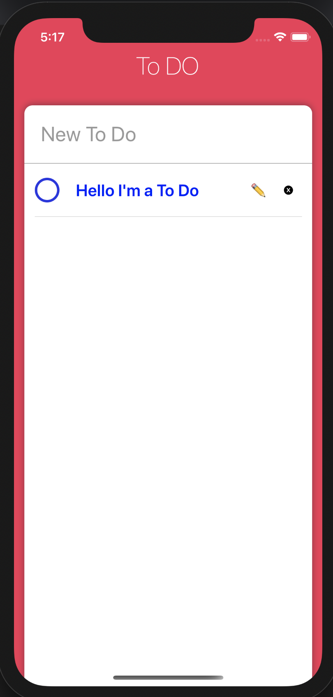

# React-Native

## 목차

> 1. 개발한 것
>
>    - [Get Weather App](#get-weather-app)
>    - [To Do List App](#to-do-list-app)
>
> 1. 요구 프로그램
>
>    - [Homebrew](#homebrew)
>    - [NodeJS & NPM](#nodejs)
>    - [Expo-Cli](#expo-cli)
>    - Xcode (for simulator)
>    - Android studio
>    - Watchman
>
> 1. 정리
>    - [flex](#flex)
>    - [위치 받아오기](#위치-받아오기)
>    - [axios](#axios)
>    - [api 키값 숨기기](#api-키값-숨기기)

## 개발한 것

GetWeatherApp

<a href="https://github.com/azzyjk/React-Native/tree/master/getWeather"></a>

To Do List App

<a href="https://github.com/azzyjk/React-Native/tree/master/TodoList"></a>

## 요구 프로그램

### Homebrew

Homebrew는 맥(macOS)에서 필요한 패키지를 설치하고 관리해주는 패키지 관리자이다.  
Homebrew를 사용하면 맥에서 간단히 패키지를 설치할 수 있다.

#### 설치방법

아래의 명령어를 터미널에 복사 붙여넣기 하면 된다.

    /bin/bash -c "\$(curl -fsSL https://raw.githubusercontent.com/Homebrew/install/master/install.sh)"

설치 후에 아래의 명령어를 통해 설치가 되었는지 확인한다.

    brew --version

설치가 되었으면 버전이 나온다.

    Homebrew 2.2.16
    Homebrew/homebrew-core (git revision 78552a; last commit 2020-05-14)

### NodeJS

NodeJS는 확장성 있는 네트워크 애플리케이션 개발에 사용되는 소프트웨어 플랫폼이다.
React Native는 Nodejs가 필요하므로 설치해야 한다.

#### 설치방법

아래의 명령어를 터미널에 복사 붙여넣기 하면 된다.
현재 날짜 20년 05월 21일 기준으로 nodejs 14.3이 최신버전 이지만 12.16버전이 LTS버전이므로 12.16버전을 설치해 주었다.

    brew install node@12

설치 후 아래 명령어를 통해 설치가 되었는지 확인한다.

    node --version

설치가 되었으면 버전이 나온다.

    v12.16.3

### NPM

NPM(Node Package Manager)은 자바스크립트 프로그래밍 언어르 위한 패키지 관리자이다.

NodeJS를 설치하면 NPM도 같이 설치 되므로 NPM도 설치가 되었는지 아래의 명령어로 확인한다.

    npm --version

설치가 되었으면 버전이 나온다.

    6.14.4

### Expo-Cli

Expo는 React Native로 하는 개발을 쉽게 할 수 있게 해주는 툴이다.
RN을 위한 설정이 미리 구성되어 있으며 native 파일들을 개발자에게서 숨겨놓고 알아서 관리해준다.

#### 장점

- React Native를 위한 설정이 미리 구성되어 있어 개발 시작하기가 편하다.
- 배포 후 업데이트 버전은 Expo에 publish만 해주면 알아서 업데이트 해준다.

#### 단점

- Expo에서 제공하는 API만 사용이 가능하다.
- native 파일들을 많이 제어할 수 없다.

#### 설치방법

아래의 명령어를 터미널에 입력해 설치한다.

    npm install -g expo-cli

#### 실행방법

    expo init 'Project Name'
    cd 'Project Name'
    expo start

## 정리

### Flex

style에서의 flex는 화면에서 얼마나 차지할 것인지 나타낸다.
View를 2개 만든다음에 각각 스타일에 flex를 1로 설정하면 다음처럼 된다.


만약 2:1비율로 만들고 싶다면 하나의 View의 flex와 다른 하나의 flex를 2:1 비율로 맞춰주면 된다.

```javascript
testOne:{
    flex: 2
},
testTwo:{
    flex: 1
}
```

```javascript
testOne:{
    flex: 4
},
testTwo:{
    flex: 2
}
```


원하는 비율로 flex를 설정해주면 원하는 색으로 꾸밀 수 있다.


### 위치 받아오기

expo는 모듈을 사용할때 import해주는 방식이라 위치를 받아올려면 현재 개발중인 폴더에 간 다음

    expo install expo-location

을 통해 해당 모듈을 설치해 준다.  
이후 코드에

```javascript
import * as Location from "expo-location";
```

를 추가해준 다음에
코드에

```javascript
getLocation = async () => {
    try {
      await Location.requestPermissionsAsync(); // 위치를 구하기 위한 권한
      const {
        coords: { latitude, longitude },
      } = await Location.getCurrentPositionAsync(); // 위치 받아오기
    } catch (error) {
      //사용자가 위치 찾는걸 거부하거나 위치를 찾을 수 없는경우에 실행할 코드 입력
    }
};
componentDidMount() {
    this.getLocation();
}
```

를 입력한뒤 이용해주면 된다.

### axios

axios는 javascript에서 fetch와 같은 역활을 하지만 기능과 사용법이 다르다.

#### 사용방법

우선 axios 모듈을 아래 명령어를 이용해 해당 프로젝트에 설치해 주어야 한다.

    npm install axios

이후 해당 명령어로 axios를 import 해준다.

```javascript
import axios from "axios";
```

이후 아래와 같은 코드로 결과를 받아온다.

```javascript
getWeather = async () => {
  const data = await axios.get(`인터넷 주소`);
};
```

### API 키값 숨기기

코드를 깃헙에 올릴때 API 키값 같은 경우는 도용될 수 있으므로 숨겨서 올려야한다.
react-native-dotenv 패키지를 설치하여 키값이 들어있는 파일을 제외하고 올리게 할 수 있다.

#### 사용방법

이를 위해 우선 react-native-dotenv 패키지를 설치해 주어야 한다.
아래와 같은 명령어를 프로젝트가 존재하는 폴더에 가서 쳐주면 된다.

    npm install react-native-dotenv --save-dev

이후 프로젝트 최상위 폴더에 있는 `babel.config.js`에 dotenv모듈을 추가한다.

    // babel.config.js
    presets: [
      "module:metro-react-native-babel-preset",
      "module:react-native-dotenv",
    ],

프로젝트 최상위 폴더에 `.env` 파일을 생성한뒤 api key 값을 입력한다.

    // .env
    API_KEY = "Input your api key"

이후 키값이 필요한 부분에 key를 import한 뒤 변수처럼 사용하면 된다.

```
import API_KEY from "react-native-dotenv";
```

마지막으로 `.gitignore`파일에 `.env`파일을 추가하여 커밋되지 않도록 한다.

    // .gitignore
    .env
